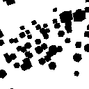

# Simulated annealing 3d art
A program that uses simulated annealing to optimize the positions and rotation angles of multiple cubes, resulting in the target image.




## Usage

### Run training and viewing the result.
```
git clone https://github.com/428lab/simulated_annealing_3d_art.git
cd simulated_annealing_3d_art
./run.sh
```

## Detail

### Training
This optimizes the positions, size and rotation angles of 200 cubes.
It takes several minutes. love.bmp is target image.
```
python simulated_annealing_3d_art.py --target-img love.bmp --num-cubes 200 --max-iter 40000 --start-temp 10.0 --end-temp 0.1 --min-cube-size 0.1 --max-cube-size 0.5
```
final_cubes.pkl which includes x,y,z, size and angle of 200 cubes is output by the training.


### View the result
Rendering final_cubes.pkl with OpenGL.
```
python viewer_3d_art.py --cubes-file love_cubes.pkl --img-size 128 
```
